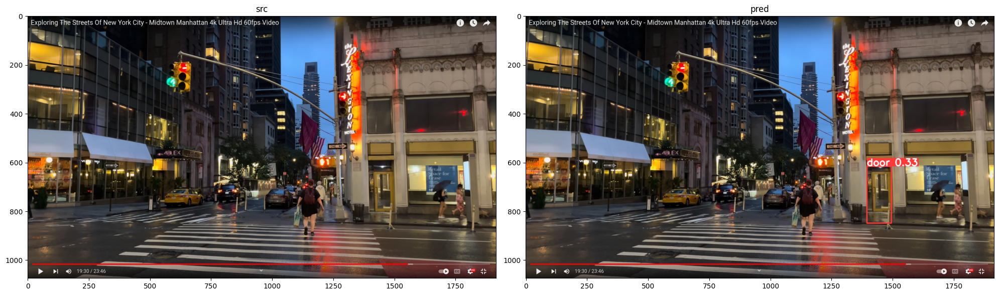
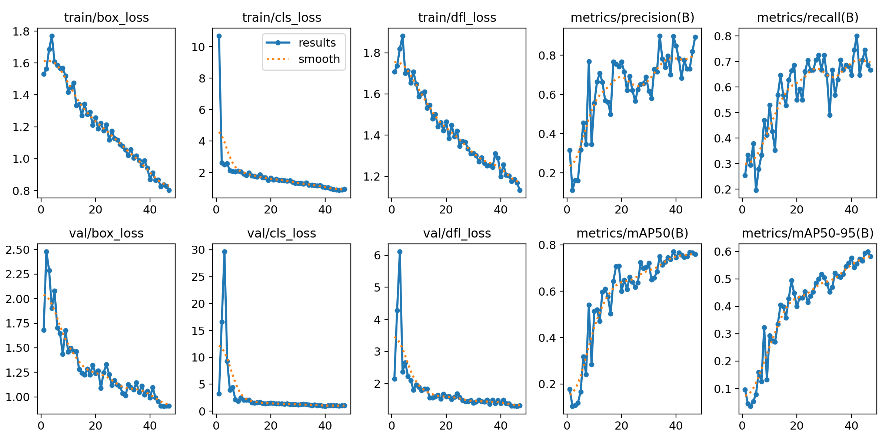

# YOLOv8 Door Detection for Visually Impaired Individuals

## [Medium](https://medium.com/@elsayed_mohamed/how-to-train-your-own-first-yolov8-model-door-detection-for-visually-impaired-people-4d08b5e37612)

Imagine a world where doors become more than just obstacles for the visually impaired. Our YOLOv8 project revolutionizes accessibility by using cutting-edge computer vision technology to detect doors.

## Dataset

The dataset has been collected from New York and annotated through a combination of auto-annotation and manual enhancement.

**Dataset Download:**
[Download Dataset](https://drive.google.com/file/d/1-0dWfmeUXN7V1tvZQubcRW6frCEu8fjq/view?usp=sharing)


## Installation and Usage

1. Install the required library:

```bash
   pip install ultralytics
   ```

2. Load the model:
   ```python
   from ultralytics import YOLO
   model = YOLO("yolov8s.pt")  # Load the pretrained model
   ```

3. Training the model:
   ```python
   model.train(data='/content/data.yaml', epochs=47, imgsz=1280, batch=8)
   ```

4. Load the best model:
   ```python
   model = YOLO("/content/runs/detect/train2/weights/best.pt")  # Load the best model
   ```

5. Making predictions:
   ```python
   res = model.predict("/content/test.png", save=True, conf=0.3)
   ```

6. Visualizing results:
   ```python
   import matplotlib.pyplot as plt
   import matplotlib.image as mpimg

   # Load your images
   image1 = mpimg.imread('/content/test.png')
   image2 = mpimg.imread('/content/runs/detect/predict2/test.png')

   # Plotting the images side by side
   plt.figure(figsize=(20, 20))
   plt.subplot(1, 2, 1)
   plt.imshow(image1)
   plt.title('Source Image')

   plt.subplot(1, 2, 2)
   plt.imshow(image2)
   plt.title('Predicted Image')

   plt.tight_layout()
   plt.show()
   ```





Here's a checklist of key points for YOLOv8 door detection project:

- [x] **Data Annotation:**
  - [x] Auto-annotate dataset using a cutting-edge solution.
  - [x] Enhance annotations manually for improved accuracy.

- [x]  **Model Training:**
  - [x] Load the pre-trained YOLOv8 model.
  - [x] Train the model using the annotated dataset.
  - [x] Evaluate model performance .

- [x] **Share Weights:**
  - [x] Save model weights after training.
  - [x] Share trained model weights with the community.

- [x] **Share Data:**
  - [x] Provide access to the annotated dataset for transparency.
   
- [ ] **Hugging Face deployment:**
  
  - [x] convert model into onnx
  - [ ] Deploy the trained YOLOv8 model on Hugging Face.

- [ ] **API deployment:**
  - [x] convert model into onnx
  - [ ] FastAPI code for deployment.
  - [ ] docker image
  - [ ] deploymernt into AWS

- [ ] **Mobile deployment:**
  - [x] convert model into tflite
  - [ ] flutter code.
